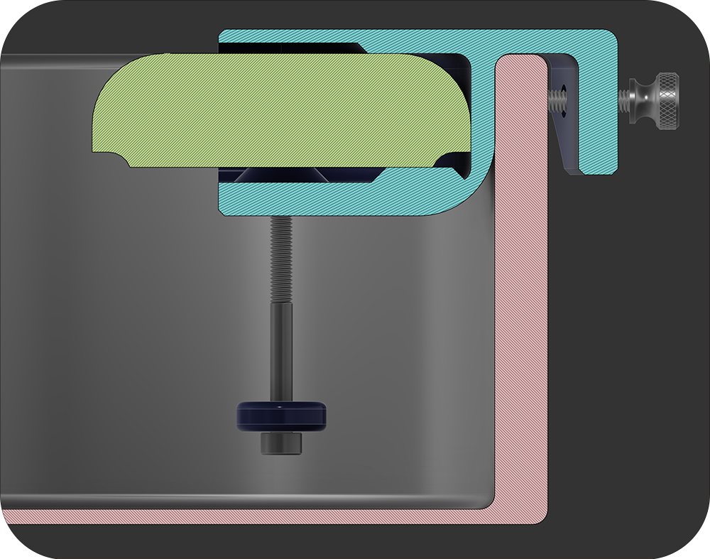

# Installation for Smart Pet Water Sensor
Thank you for your purchase of the Smart Pet Water Sensor!

Three sets of sensing screws are included in your purchase. The screws that contain the plastic washer will be the recomended length screws to start with. The other 2 sets will be one size shorter and one size longer. 

If you would like to adjust how much water is left in the bowl before the sensor triggers then you can change the screws. The screw lengths differ by 5mm increments. 

## Installation
### **1. Place the sensor in the plastic clip. Ensure the sensor screws are aligned with the holes.**

### **2. Screw in the sensing screws until they are finger tight and aligned with the sensor.**

### **3. Unscrew the included thumb screws far enough to clear the lip of the bowl.**

### **4. Place the sensor on the lip of the bowl and adjust the thumb screws untill the sensor sits level on the lip of the bowl. No force is needed. They are just to hold the sensor in the correct position.**

## Still Need help? Have more questions?
Feel free to reach out to us via [Etsy](https://watchtower3d.etsy.com) anytime!