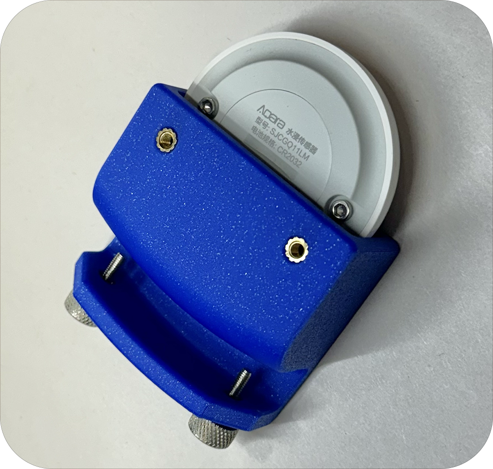
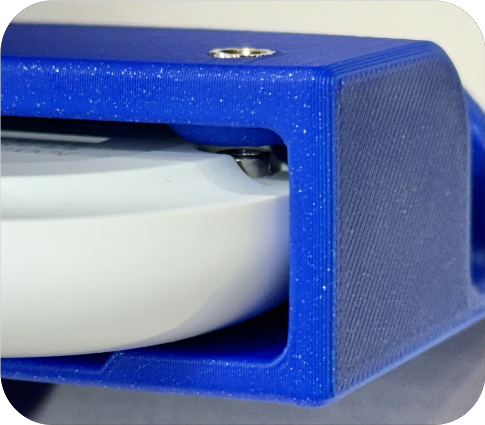
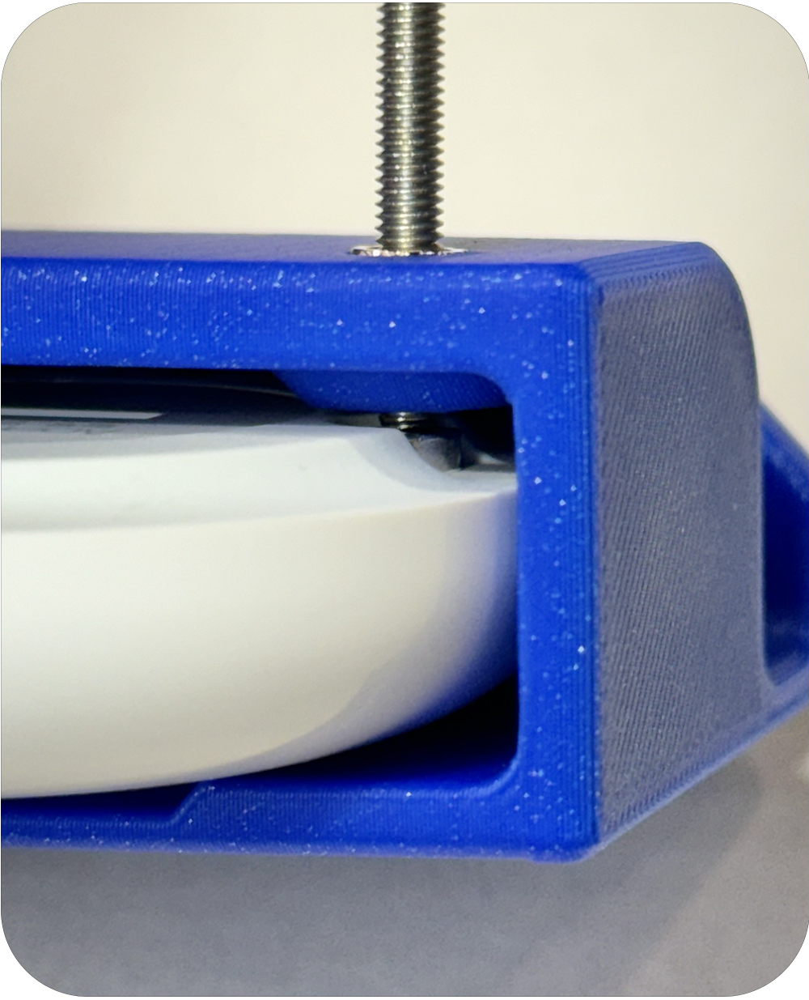
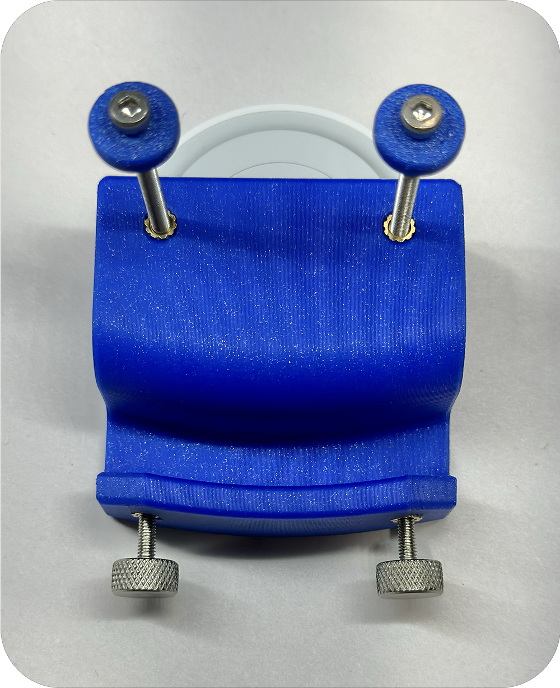

# Installation for Smart Pet Water Sensor
Thank you for your purchase of the Smart Pet Water Sensor!

Included in your purchase is 3 sets of sensing screws. The screws that contain the plastic washer will be the recomended length screws to start with. The other 2 sets will be one size shorter and one size longer. 

If you would like to adjust how much water is left in the bowl before the sensor triggers then you can change the screws. The screw lengths differ by 5mm increments. 

## Installation
1. **Place the sensor in the plastic clip. Ensure the sensor screws are alighted with the bottom holes**

1. **Screw in the sensing screws till they are finger tight and aligned with the sensor screws**

1. **Unscrew the included thumb screws far enough to clear the lip of the bowl.**

1. **Place the sensor on the lip of the bowl and adjust the thumb screws till the sensor sits level on the lip of the bowl.**

## Still Need help? Have more questions?
Feel free to reach out to us via [Etsy](https://watchtower3d.etsy.com) anytime!