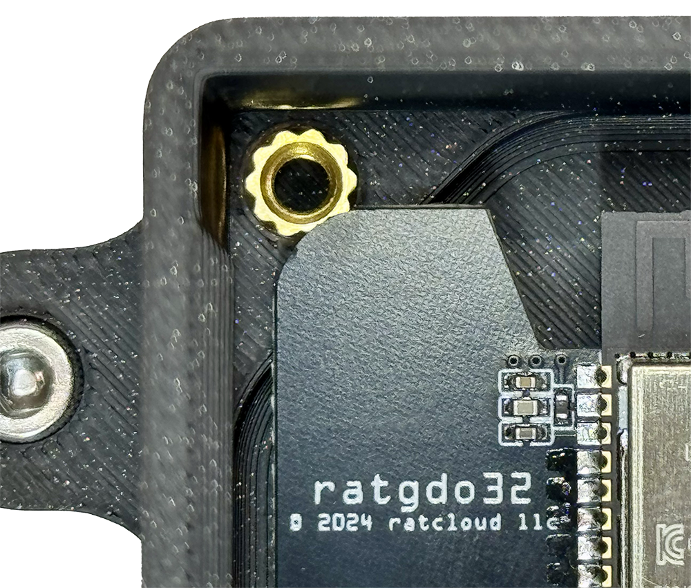
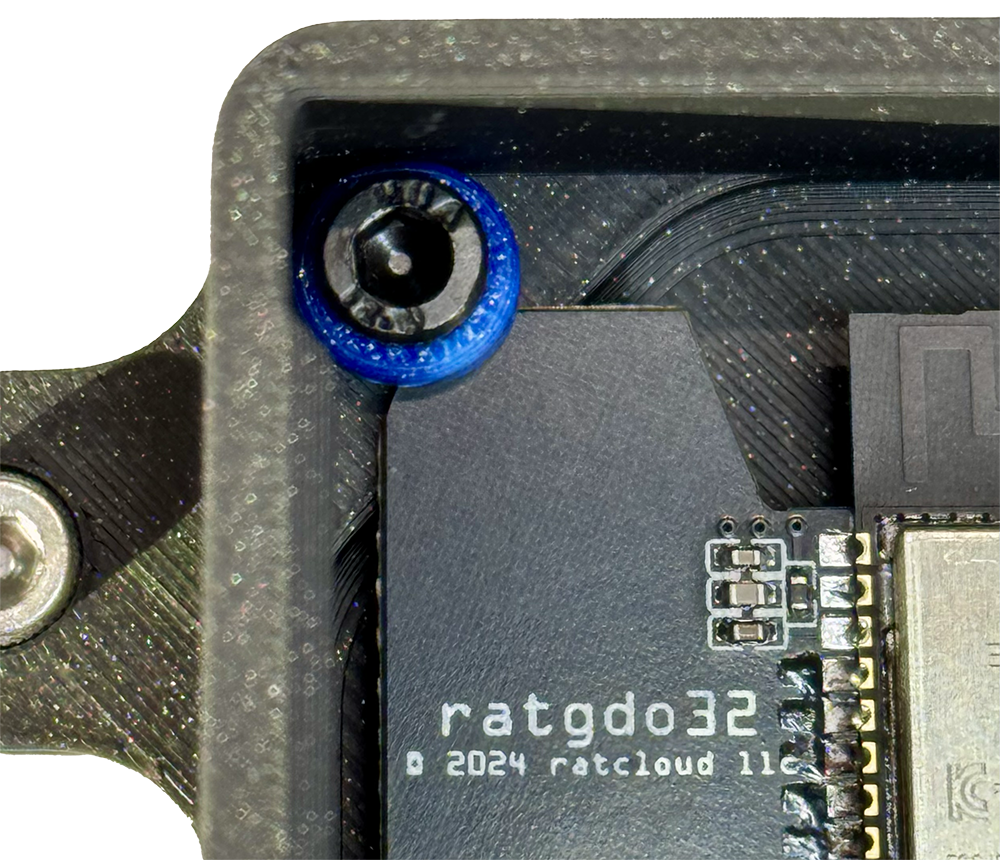

# Installation for ratgdo32 & v2.x PCB Case
Thank you for your purchase of the ratgdo32 or v2.x case/enclosure!

All versions of the enclosures are designed to be able to secure the PCB with the screws provided. The PCB is to be placed in first, then the washer/spacer. 

To securely mount the **ratgdo32** PCB into the case, align the USB-C port with the center of the opening. Once aligned, use the provided screw and washer to fasten the PCB in place by securing it at the corner, as illustrated below. 

For **v2.5 (Non integrated ESP)** you will need to remove the ESP from the board. It should be removed vertically.

For **v2.0 (Non integrated ESP)**, install with the ESP attached to the board.

## Installation Options
* Install Magnetically. 
    * Useful when attaching to the body of the opener or to the top metal plate. 
* Screw mounted using the back strap provided. 
    * This is to be able to mount using preexisting punched/slotted angle on the opener itself or vertical supports. Example Below.
* Zip tie using the ears on the side.

## Strain Relief for v2.52i
The strain relief for v2.52i is optional but recommended, as the connectors are fragile. 

There are recesses built into the lid in the event that the zip tie head sits proud of the case top. Flush cutting the zip tie tail is recomended. Additional zip ties are included in your kit for the strain relief.

## Still Need help? Have more questions?
Feel free to reach out to us via [Etsy](https://watchtower3d.etsy.com) anytime!

